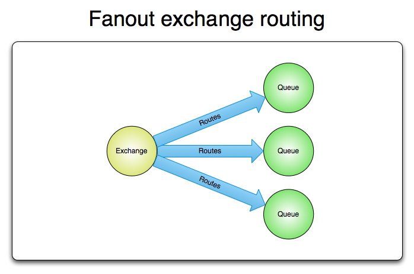

# RabbitMQ

## AMQP协议

**RabbitMQ**使用**AMQP 0-9-1**版本。**AMQP ** *Advanced Message Queuing Protocol*  高级消息队列协议是一个网络协议。支持符合要求的客户端应用 *application* 和消息中间件代理 *messaging middleware broker* 之间进行通信。

消息代理从发布者（生产者）接收消息，并根据路由规则将接收的消息发送给消费者。由于**AMQP**是网络协议，所以发布者、消费者、消息代理可在不同设备上。

**AMQP**工作流程如下

消息 *message*  被发布者 *publisher* 发送给交换机，交换机将消息根据路由规则分发给绑定的队列 *queue*，最后**AMQP**代理将消息投递给此队列的消费者 *consumer*，或者消费者按照需求自行获取。

发布者发布消息时可以给消息指定各种消息属性。有些属性用于消息代理（broker），除此之外的属性只能被接收消息的应用使用。

**AMQP**模块包含了消息确认 *message acknowledgements* 的概念，当消息被投递给消费者后，消费之会通知消息代理，可以自动也可以由开发者指定。启用消息确认后，消息代理不会完全将消息删除，直到收到消费者的确认回执。

消息无法被成功路由时，消息可能被返回给发布者并被丢弃，或者消息代理执行了延期操作，消息会被放入一个所谓的死信队列中，消息发布者可以选择某些参数来处理这些特殊情况。

> 由上图可知，交换机对应queue，当消息在队列 *queue* 中变成死信后，它能被重新发送到一个交换机中，这个交换机称为死信交换机，与该交换机绑定的队列称为死信队列。消息成为死信的情况为：
>
> * 消息被拒绝
> * 消息过期
> * 队列达到最大长度

队列、交换机和绑定统称为**AMQP**实体 *AMQP entities*。

## 交换机

交换机时用来发送消息的**AMQP**实体。交换器拿到一个消息之后将它路由给一个或者零个队列。它使用哪种路由算法是由交换机类型和被称为绑定 *bindings* 的规则决定的。**AMQP 0-9-1**的代理提供了四种交换机：

1. 直连交换机 *direct exchange*
   * 预声明的默认名称 *(Empty string) and amq.direct*
2. 扇形交换机 *fanout exchange*
   * *amq.fanout*
3. 主题交换机 *topic exchange*
   * *amq.topic*
4. 头交换机 *headers exchange*
   * *amq.match(and amq.headers in RabbitMQ)*

声明交换机时除了类型外，还可以附带其他很多属性，比较重要的有：

* **Name**
* **Durability**
  * 消息代理重启后，交换机是否还存在（是否可持久化）
* **Auto-delete**
  * 当所有与之绑定的消息队列都完成了对此交换机的使用后，删掉它
* **Argument** 
  * 消息代理本身

### 默认交换机

实际上是一个由消息代理预先设定好的，没有名字的**直连交换机** *direct exchange*。每个新建的队列 *queue* 都会自动绑定到默认交换机上，绑定的路由键 *routing key* 名称与队列名称相同。

### 直连交换机

根据消息携带的路由键 *routing key* 将消息投递给对应队列的。直连交换机用来处理消息的单播路由*unicast routing*。

* 将队列绑定到某个交换机上，同事赋予该绑定一个路由键；
* 当一个携带着路由键为 **R** 的消息被发送给直连交换机时，交换机会把它路由给绑定值同样为 **R** 的队列。

通常用于循环发送任务给多个工作者。消息的负载均衡发生在消费者间，而非队列间。

### 扇形交换机

将消息路由绑定到它身上所有的队列，而不识别路由键。如果 **N** 个队列绑定到某个扇形交换机上，当有消息发送给此扇形交换机时，交换机会将消息的拷贝发送给所有的队列。扇形交换机用来处理消息的广播路由。比如大规模多人在线的程序的全局消息、比赛转播网站发送比分信息到移动终端。

### 主题交换机

通过对消息的路由键和队列到交换机的绑定模式之间的匹配，将消息路由给一个或者多个队列。主题交换机经常用来实现各种分发/订阅模式及其变种。主题交换机通常用来实现消息的多播路由 *multicast routing*。

### 头交换机

用起来和直连交换机类似，但不需要路由键，仅匹配消息头的值能否与指定的绑定相匹配来确立路由规则。

## 队列

存储即将被应用消费掉的消息。队列跟交换机共享某些属性，但队列也有一些另外的属性。

* **Name**
* **Durable** 
  * 消息代理重启后，队列依旧存在
* **Exclusive**
  * 只被一个连接使用，且当该连接关闭后，队列即被删除
* **Auto-delete**
  * 当最后一个消费者退订后，即被删除

队列被声明后才能被使用，如果队列尚不存在，声明队列会创建它。如果声明的队列已经存在，且属性完全相同，那么此声明不会对原有队列产生任何影响。如果声明中的属性与已存在队列的属性有差异，会抛一个代码为406的通道级异常。

## 绑定

绑定时交换机将消息路由给队列所遵循的规则。绑定操作需要定义一个可选的路由键属性给某些类型的交换机。路由键的意义在于从发送给交换机的众多消息中选择出某些消息，将其路由给绑定队列。举个栗子：

* 队列是旅行的目的地；
* 交换机是机场；
* 绑定是机场到目的地的路线，路线可以是一条或者多条。

## 消费者

消息必须被消费掉才有意义，有两种途径可以达成此目的：

* 将消息投递给应用 *push*
* 应用根据需求主动获取消息 *pull*

使用 *push* ，应用（application）需要明确表示出它在某个特定队列里所感兴趣的，想要消费的消息。如是，我们可以说应用注册了一个消费者，或者说订阅了一个队列。一个队列可以注册多个消费者，也可以注册一个独享的消费者（当独享消费者存在时，其他消费者即被排除在外）。

每个消费者（订阅者）都有一个叫做消费者标签的标识符。它可以被用来退订消息。消费者标签实际上是一个字符串。

## 消息确认

消费者应用 *Consumer applications* - 用来接受和处理消息的应用 - 在处理消息的时候偶尔会失败或者有时会直接崩溃掉。而且网络原因也有可能引起各种问题。那么**AMQP**代理在什么时候删除消息才是正确的？**AMQP 0-9-1** 规范给我们两种建议：

- 当消息代理将消息发送给应用后立即删除。（使用**AMQP方法**：basic.deliver或basic.get-ok）
- 待应用发送一个确认回执 acknowledgement* 后再删除消息。（使用**AMQP方法**：basic.ack）

前者被称作自动确认模式 *automatic acknowledgement model* ，后者被称作显式确认模式 *explicit acknowledgement model* 。在显式模式下，由消费者应用来选择什么时候发送确认回执*acknowledgement* 。应用可以在收到消息后立即发送，或将未处理的消息存储后发送，或等到消息被处理完毕后再发送确认回执（例如，成功获取一个网页内容并将其存储之后）。

如果一个消费者在尚未发送确认回执的情况下挂掉了，那**AMQP**代理会将消息重新投递给另一个消费者。如果当时没有可用的消费者了，消息代理会死等下一个注册到此队列的消费者，然后再次尝试投递。

## RabbitMQ

上述为**AMQP**的部分内容，开发人员需实现**publisher**和**consumer**，以及交换机、队列和绑定关系。

